exclude: true
<style type="text/css">
code.r{
  font-size: 16px;
}
pre {
  font-size: 16px !important;
}
</style>
```{r setup, include=FALSE}
options(htmltools.dir.version = FALSE)
```
---
class: split-two
<link rel="stylesheet" href="https://cdnjs.cloudflare.com/ajax/libs/font-awesome/4.7.0/css/font-awesome.min.css">
.column.bg-main1[
.font2.comfortaa.coral[Prediction of Seasonal Agricultural Productivity Anomalies Derived from MODIS Data for the Cultivated Land of Chile]<br></br></br>
.font2.comfortaa[Dr. Francisco Zambrano  Bigiarini <br><br> Researcher at .yellow[Hémera]<br>]
<br>
.font1.comfortaa[`r anicon::faa('link', animate='vertical', rtext='&nbsp;hemera.umayor.cl', color='white')` <br>]

.font1.comfortaa[`r anicon::faa('github', animate='pulse', rtext=' frzambra', color='white')` <br> `r anicon::faa('twitter', animate='pulse', rtext=' @frzambra', color='00acee')`<br>`r anicon::faa('envelope', animate='pulse', rtext=' francisco.zambrano@umayor.cl', color='white')`<br>]
.font_large[2019 Joint Satellite Conference, Boston, MA, USA 
</br>
<br>
October 3, 2019]
.font1.comfortaa[`r anicon::faa('link', animate='vertical', rtext='&nbsp;https://frzambra.github.io/JointSatellite2019/Slides-JointSatellite2019', color='white')`
]
]
.column.bg-main3.center[
.vmiddle[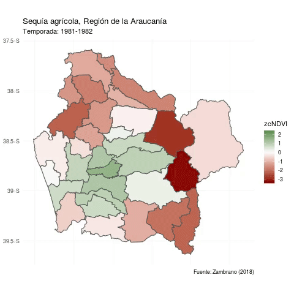]
]
<!-- --- -->
<!-- class: bg-main1 -->

<!-- # Why am I here? -->

<!-- -- -->
<!-- ### Teach you how to code in R `r emo::ji("x")` -->

<!-- -- -->
<!-- ### Teach you how you *should* use R `r emo::ji("heavy_check_mark")` -->

<!-- -- -->
<!-- ### Teach you how to make writing R code enjoyable `r emo::ji("heavy_check_mark")` -->

<!-- -- -->
<!-- ### Teach you how to learn R `r emo::ji("heavy_check_mark")` -->

<!-- --- -->
<!-- class: middle bg-main1 -->

<!-- # How most academics learn R -->

<!--  -->

<!-- --- -->
<!-- class: middle bg-main1 -->

<!-- # How .yellow[should] you use R? -->

---
layout: true
---
class: split-two with-border border-white fade-row2-col1 fade-row3-col1 fade-row4-col1

.column[
  .split-four[
  .row.bg-main1[.content.font2[
What is the .yellow[problem] and how we .yellow[addressed] it?
  ]]
  .row.bg-main4[.content.font2[
Deriving the proxy (.yellow[output]) `r anicon::faa('map-marker-alt', animate='float', size=1,color='yellow')` 
]]
  .row.bg-main4[.content.font2[
Predictor variables `r anicon::faa('chart-line', animate='float', size=1)`
]]
  .row.bg-main4[.content.font2[
Prediction models `r anicon::faa('walking', animate='float', size=1)`]]
]]

.column.bg-main1[.content.center.vmiddle[
<!--  -->

]]


<!-- --- -->
<!-- class: hide-row2-col1 hide-row3-col1 hide-row4-col1  -->
<!--  -->
<!--  -->
<!-- --- -->
<!-- class: hide-row3-col1 hide-row4-col1 -->
<!--  -->
<!--  -->
<!--  -->
<!-- --- -->
<!-- class: hide-row4-col1 -->
<!--  -->

<!-- --- -->
<!-- class: -->
<!--  -->

<!-- --- -->
<!-- class: fade-row2-col1 fade-row3-col1 fade-row4-col1  -->
---
layout: false
class: bg-main1

# Cultivated land of Chile

.center[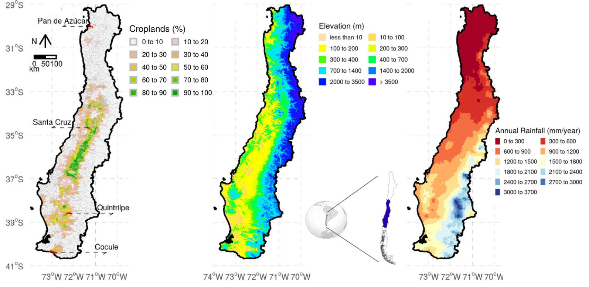]


---
layout: false
class: bg-main1

# .yellow[Agricultural drought] in Chile

.font2.comfortaa[A persistent .yellow[rainfall deficit] has been affecting Central-South Chile .yellow[since 2007].]

.center[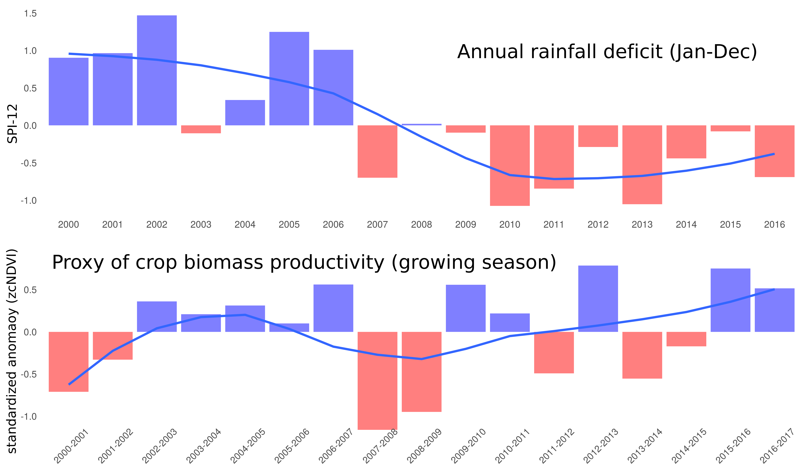]

<!-- --- -->
<!-- layout: false -->
<!-- class: bg-main1 -->
<!-- # .yellow[Sequía] en Chile -->

<!-- ## Año 2019 -->

<!-- .center[] -->

---
layout: false
class: bg-main1
# How we can study agricultural drought at regional scale?

.font2.comfortaa[
- Crop growth model `r icon::fa('times')`

- Agricultural census (yield, production, ) `r icon::fa('times')`

- Using a .yellow[proxy] for agricultural productivity. `r icon::fa('check')`
  - Commonly by vegetation indices (VIs) derived from satellite images.
  - NDVI one o the most common used indices.

]


---
class: bg-main1

# .yellow[Proxy] proposed by our study

.font2.comfortaa[Cumulative NDVI within the growing season]

.center[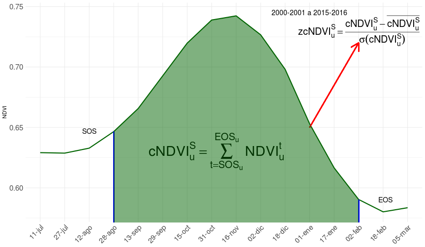]

---
class: bg-main1

# Proposed prediction by our study

.font2.comfortaa[
- What we want to predict .yellow[(output)]? the proxy of agricultural productivity .yellow[(zcNDVI)]

- What variables we used for the prediction (.yellow[Inputs]):
  - the proxy itself months before the end of the growing season (EOS).
  - Standardized precipitation index (SPI) at 1-, 3-, 6-, 12- y 24-months .
  - Climatic oscillation indices (PDO and MEI)

- .yellow[When?:] forecast lead times from .yellow[one- to six-month] before the end of the growing season (EOS)

- .yellow[Where?:] at census units, considering those which has cultivated land.
]

---
class: split-two with-border border-white fade-row1-col1 fade-row3-col1 fade-row4-col1

.column[
  .split-four[
  .row.bg-main1[.content.font2[
What is the .yellow[problem] and how we .yellow[addressed] it?
  ]]
  .row.bg-main4[.content.font2[
Deriving the proxy (.yellow[output]) `r anicon::faa('map-marker-alt', animate='float', size=1,color='yellow')` 
]]
  .row.bg-main4[.content.font2[
Predictor variables (.yellow[inputs])
]]
  .row.bg-main4[.content.font2[
Prediction models `r anicon::faa('chart-line', animate='float', size=1)`]]
]]

.column.bg-main1[.content.center.vmiddle[


]]

---
layout: true
class: split-two with-border border-white

.column[
  .split-four[
  .row.bg-main1[.content.font2[
Were determined the census units having > 10% of cultivated land.
  ]]
  .row.bg-main4[.content.font2[
Per census unit the Start Of the growing Season (SOS) was estimated
]]
  .row.bg-main4[.content.font2[
Per census unit the End Of the growing Season (EOS) was estimated
]]
  .row.bg-main4[.content.font2[
Finally, for each census units was calculated the proxy $(zcNDVI)$]]
]]

.column.bg-main3[.content.center.vmiddle[
{{content}}
]] 

---
class: fade-row2-col1 fade-row3-col1 fade-row4-col1 
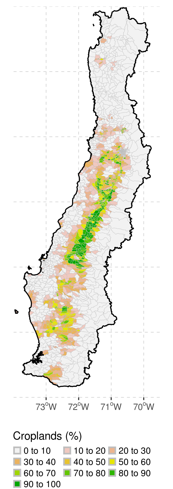
---
class: fade-row1-col1 fade-row3-col1 fade-row4-col1
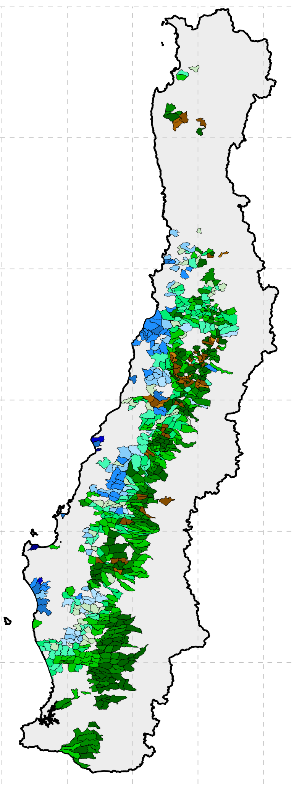
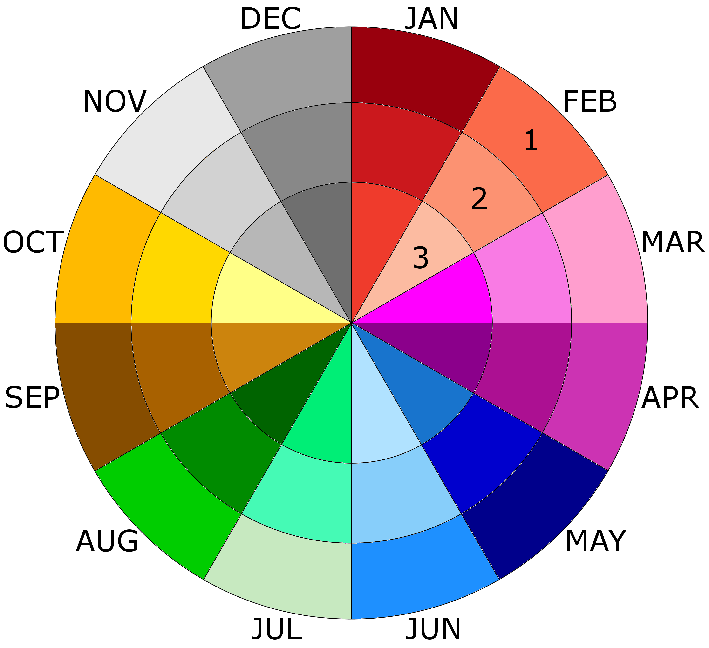
---
class: fade-row1-col1 fade-row2-col1 fade-row4-col1
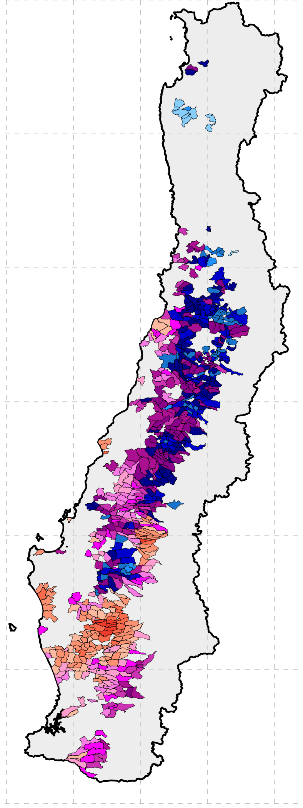


---
class: fade-row1-col1 fade-row2-col1 fade-row3-col1
 
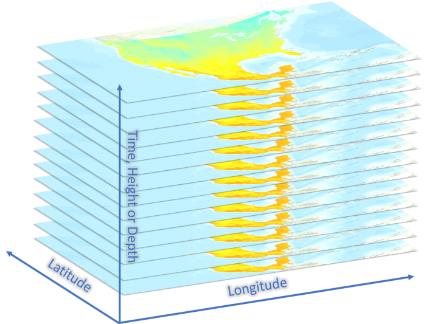
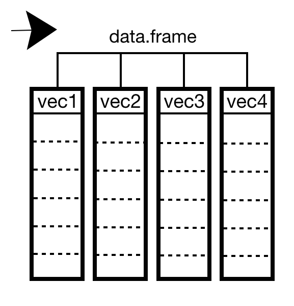

---
layout: false
class: bg-main1

# Validation of the .yellow[proxy]

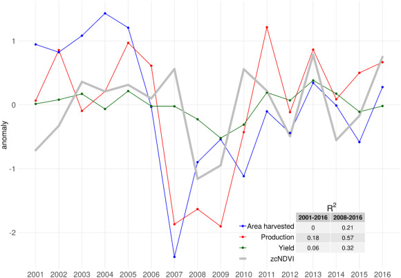
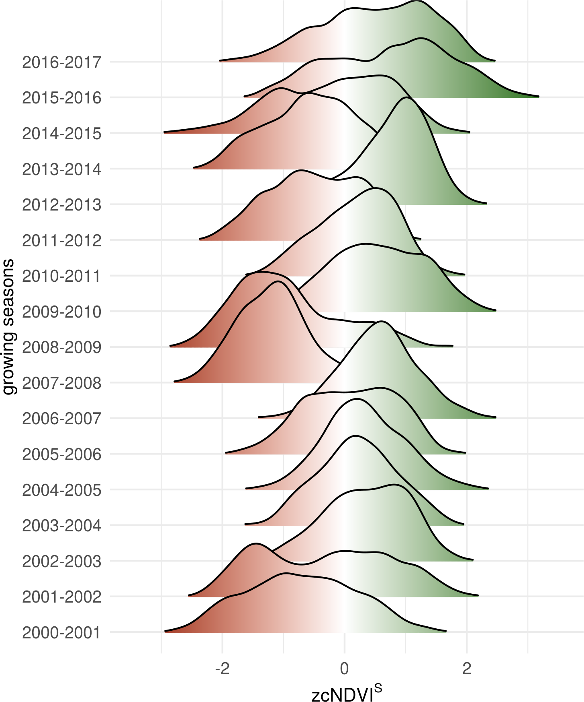

---
class: split-two with-border border-white fade-row1-col1 fade-row2-col1 fade-row4-col1

.column[
  .split-four[
  .row.bg-main1[.content.font2[
What is the .yellow[problem] and how we .yellow[addressed] it?
  ]]
  .row.bg-main4[.content.font2[
Deriving the proxy (.yellow[output]) `r anicon::faa('map-marker-alt', animate='float', size=1,color='yellow')` 
]]
  .row.bg-main4[.content.font2[
Predictor variables (.yellow[inputs])
]]
  .row.bg-main4[.content.font2[
Prediction models `r anicon::faa('chart-line', animate='float', size=1)`]]
]]

.column.bg-main1[.content.center.vmiddle[


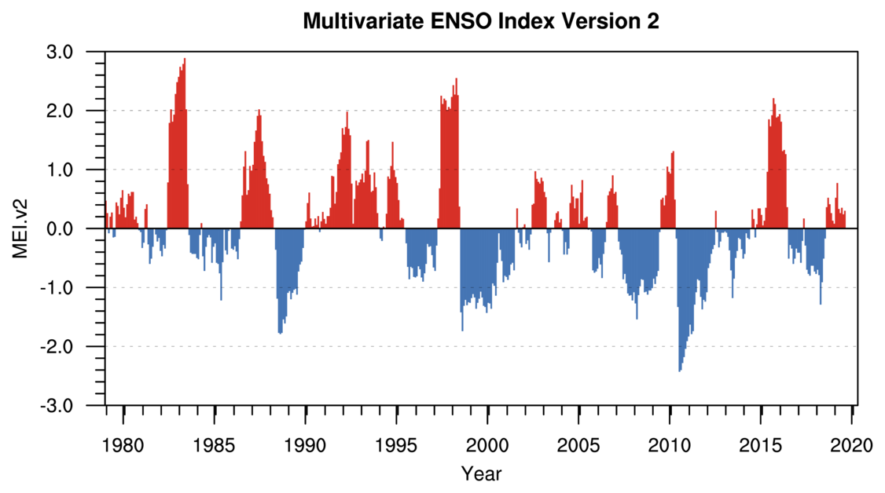
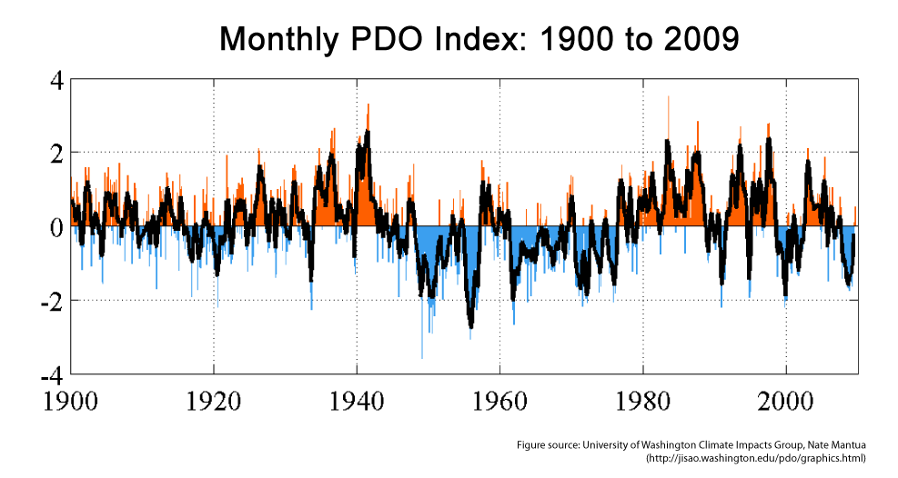
]]

---
layout: true
class: split-two with-border border-white

.column[
  .split-four[
  .row.bg-main1[.content.font2[
All the predictors (zcNDVI, SPIs, PDO, and MEI) were calculated from the end of the season...
  ]]
  .row.bg-main4[.content.font2[
...for forecasting lead times of one-month...
]]
  .row.bg-main4[.content.font2[
...two-month...
]]
  .row.bg-main4[.content.font2[
...until six-month...]]
]]

.column.bg-main3[.content.center.vmiddle[
{{content}}
]] 

---
class: fade-row2-col1 fade-row3-col1 fade-row4-col1

---
class: fade-row1-col1 fade-row3-col1 fade-row4-col1
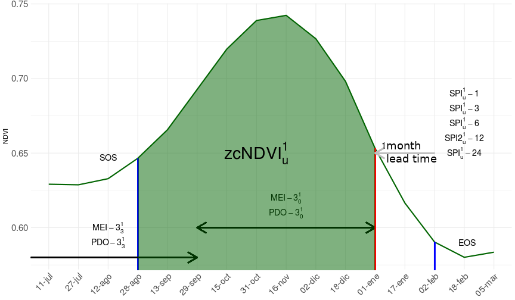
---
class: fade-row1-col1 fade-row2-col1 fade-row4-col1
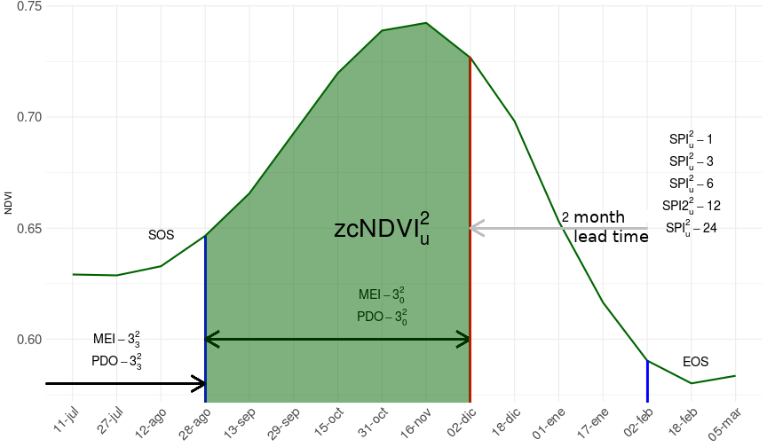

---
class: fade-row1-col1 fade-row2-col1 fade-row3-col1
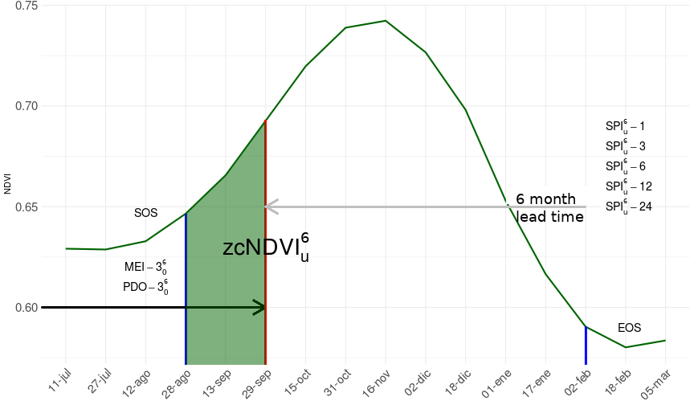

---
layout: false
class: split-two with-border border-white fade-row1-col1 fade-row2-col1 fade-row3-col1

.column[
  .split-four[
  .row.bg-main1[.content.font2[
What is the .yellow[problem] and how we .yellow[addressed] it?
  ]]
  .row.bg-main4[.content.font2[
Deriving the proxy (.yellow[output]) `r anicon::faa('map-marker-alt', animate='float', size=1,color='yellow')` 
]]
  .row.bg-main4[.content.font2[
Predictor variables (.yellow[inputs])
]]
  .row.bg-main4[.content.font2[
Prediction models `r anicon::faa('chart-line', animate='float', size=1)`]]
]]

.column.bg-main1[.content.center.vmiddle[


]]

---
layout: false
class: bg-main1

# Deep Learning vs Lineal regresion

.font2.comfortaa[

- We used a modeling scheme of .yellow[LOOCV (leave-one-out cross-validation)]
- Leaving one season out each time

.center[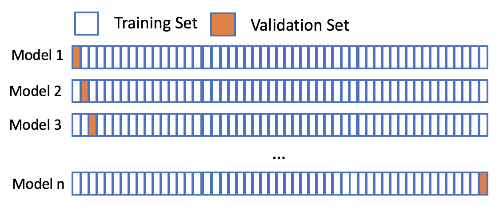]

<!-- $$RMSE_{cv} = \sqrt{\frac{\sum{(zcNDVI^S-\widehat{zcNDVI^S})^2}}{n}}$$ -->

<!-- $$R^2_{cv}$$ -->

]

---
class: bg-main1

.font2.comfortaa[

# Deep Learning vs Regresión Lineal


- Deep Learning: package .yellow[H2O] `(LeDell et al., 2014)` in  `r anicon::faa('r-project', animate='bounce', size=1,color='#165CAA')` 
  - Hyperparameter optimization .yellow[Random Grid Search]
  - 15 predictors `X` 758 units `X` 17 seasons `X` 6 lead times = 1.159.740 data

- Linear regresion: function .yellow[lm] in  `r anicon::faa('r-project', animate='pulse', size=1,color='#165CAA')`
  - 12 predictors `X` 758 units `X` 17 seasons `X` 6 lead times = 927.792 regresions
  - We selected the predictor that reach the minimum error $(RMSE_{cv})$

- Models evaluation: $RMSE_{cv}$ y $R^2_{cv}$
]
---
class: bg-main1

# Results

.center[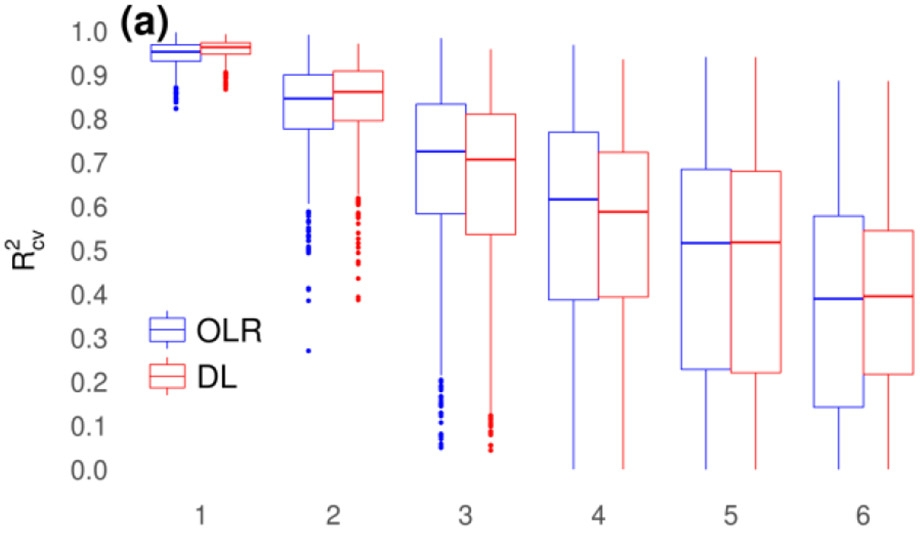]

---
class: bg-main1

# Results

.center[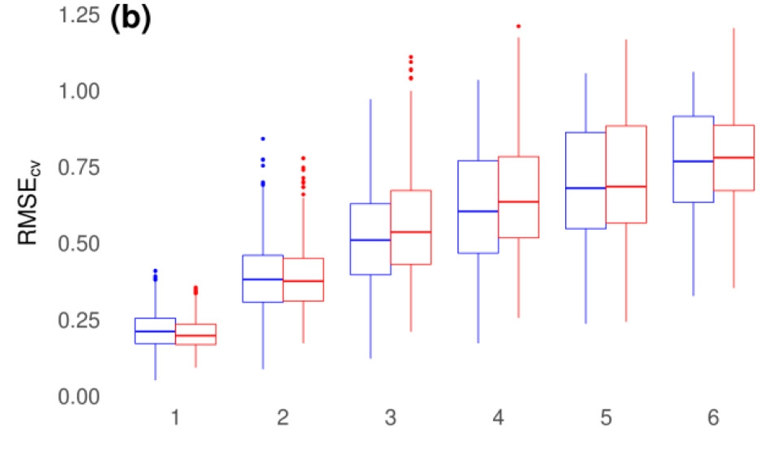]

---
class: bg-main1

# Results
## Linear regresion

.center[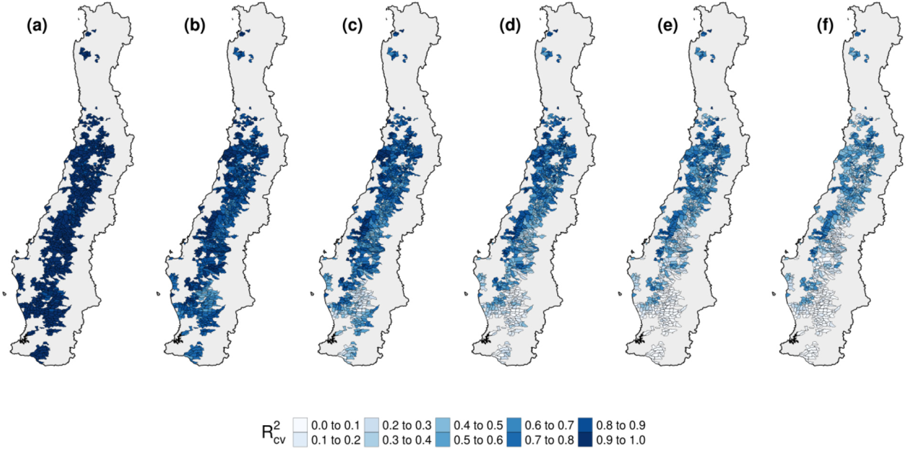]

---
class: bg-main1

# Results
## Deep Learning

.center[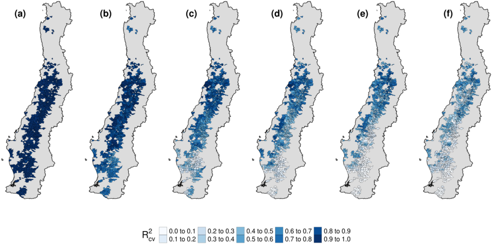]


---
layout: false
class: bg-main1

# Final remarks

.font2.comfortaa[

- Deep Learning (Black Box).

- a simple linear regresion (.yellow[in this case]) equals Deep Learning

- not enough data for Deep Learning `(LeDell, 2019)`

- we should incorporate .yellow[soil moisture] as predictor

- we .yellow[need] field data for validation
]

---
class: bg-main1 center
#Thanks!


---
class: split-two
<link rel="stylesheet" href="https://cdnjs.cloudflare.com/ajax/libs/font-awesome/4.7.0/css/font-awesome.min.css">
.column.bg-main1[
.font2.comfortaa.coral[Prediction of Seasonal Agricultural Productivity Anomalies Derived from MODIS Data for the Cultivated Land of Chile]<br></br></br>
.font2.comfortaa[Dr. Francisco Zambrano  Bigiarini <br><br> Researcher at .yellow[Hémera]<br>]
<br>
.font1.comfortaa[`r anicon::faa('link', animate='vertical', rtext='&nbsp;hemera.umayor.cl', color='white')` <br>]

.font1.comfortaa[`r anicon::faa('github', animate='pulse', rtext=' frzambra', color='white')` <br> `r anicon::faa('twitter', animate='pulse', rtext=' @frzambra', color='00acee')`<br>`r anicon::faa('envelope', animate='pulse', rtext=' francisco.zambrano@umayor.cl', color='white')`<br>]
.font_large[2019 Joint Satellite Conference, Boston, MA, USA 
</br>
<br>
October 3, 2019]
.font1.comfortaa[`r anicon::faa('link', animate='vertical', rtext='&nbsp;https://frzambra.github.io/JointSatellite2019/Slides-JointSatellite2019', color='white')`
]
]
.column.bg-main3.center[
.vmiddle[]
]
